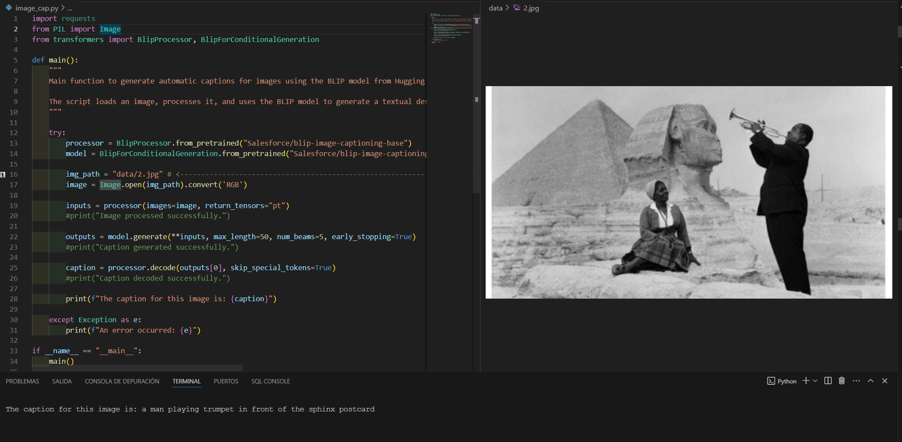

# **📸 PhotoNamesAI: Dale Nombres Significativos a tus Fotos con IA**  

<p align="center">
  
</p>  

## 🧠 **Descripción**  

**PhotoNamesAI** es una herramienta de inteligencia artificial avanzada que genera automáticamente **nombres descriptivos para imágenes**. Su objetivo es facilitar la identificación y organización de contenido visual mediante el uso de modelos de **Computer Vision y NLP**.  

✨ **¿Te imaginas una IA que mira una foto y la describe en palabras?**  
¡Eso es exactamente lo que hace **PhotoNamesAI**!  

---

## 🎯 **Posibles Aplicaciones de PhotoNamesAI**  

🚀 **Accesibilidad**  
✅ Facilita la vida de las personas con discapacidad visual proporcionando descripciones detalladas de imágenes sin etiquetas.  

📈 **SEO y Optimización Web**  
✅ Mejora el posicionamiento en buscadores al generar nombres de imágenes optimizados automáticamente.  

📂 **Organización y Descubrimiento de Contenido**  
✅ Facilita la búsqueda y categorización de imágenes en **bibliotecas digitales, galerías y archivos multimedia**.  

📲 **Automatización para Redes Sociales**  
✅ Crea descripciones atractivas para publicaciones sin esfuerzo.  

🔍 **Seguridad y Vigilancia**  
✅ Proporciona descripciones en tiempo real de actividades en secuencias de video.  

🎓 **Educación e Investigación**  
✅ Ayuda en la interpretación de imágenes y materiales visuales en múltiples disciplinas.  

🌍 **Soporte Multilingüe**  
✅ Genera títulos en **varios idiomas**, facilitando el acceso global a los contenidos.  

---

## 🚀 **Cómo Funciona**  

1️⃣ **Carga una imagen** 📷  
2️⃣ **El modelo de IA analiza el contenido visual** 🧐  
3️⃣ **Se genera un título descriptivo en lenguaje natural** ✍️  
4️⃣ **(Opcional)** Traducción automática a diferentes idiomas 🌍  

---

## 📂 **Estructura del Proyecto**  

```
├── data/              # Imágenes de entrada y ejemplos
├── image_cap.py      
└── README.md
```

---

## 🛠 **Tecnologías Utilizadas**  

🔹 **Computer Vision:** Modelos preentrenados como `CLIP`, `ViT`, `ConvNext` para análisis de imágenes.  
🔹 **NLP:** Modelos `GPT`, `T5` o `BART` para generación de descripciones.  
🔹 **Traducción Automática:** `DeepL API`, `Google Translate API` o `mT5`.  
🔹 **Frameworks:** `Hugging Face Transformers`, `PyTorch`, `TensorFlow`, `OpenCV`.  

---

## 🎯 **Ejemplo de Uso**  

```python
from scripts.predict import generate_title

image_path = "data/sample.jpg"
title = generate_title(image_path, lang="en")

print("Generated Title:", title)
```

📌 **Salida esperada:**  
```
Generated Title: "Sunset over a quiet beach with palm trees"
```

---

## 🔥 **Retos y Mejoras Futuras**  

- 📌 **Optimización del modelo** para mejorar la velocidad de predicción.  
- 📌 **Ampliación del soporte multilingüe** con modelos especializados.  
- 📌 **Implementación en dispositivos móviles** para uso en tiempo real.  
- 📌 **Integración con APIs de redes sociales** para descripciones automáticas.  

---

## 🏁 **Conclusión**  

**PhotoNamesAI** demuestra el poder de la IA en la generación de contenido visual significativo.  
Este proyecto no solo mejora la accesibilidad y la organización de imágenes, sino que abre un mundo de posibilidades en **SEO, redes sociales y automatización de contenido**.  

---

## 📌 **Contacto y Colaboración**  

🔹 **[Web](https://pdroruiz.com/)**  
🔹 **[GitHub](https://github.com/pdro-ruiz)**  
🔹 **[Kaggle](https://www.kaggle.com/pdroruiz)**  
🔹 **[LinkedIn](https://www.linkedin.com/in/)**  

📢 **Si te interesa el proyecto, no dudes en darle una ⭐ en GitHub!** 🚀  
